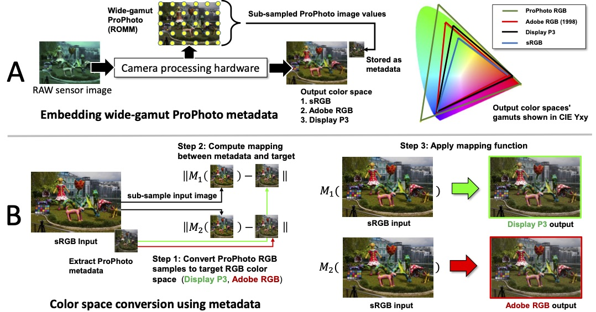

# Improving-Color-Space-Conversion-for-Camera-Captured-Images-via-Wide-Gamut-Metadata

_[Hoang M. Le](https://www.linkedin.com/in/hminle/)_1, _[Mahmoud Afifi](https://sites.google.com/view/mafifi)_1 and _[Michael S. Brown](http://www.cse.yorku.ca/~mbrown/)_1,2

1York University  
2Samsung AI Center (SAIC) - Toronto

### Overview
[PDF](https://www.ingentaconnect.com/content/ist/cic/2020/00002020/00000028/art00031)

### Dataset

- Input sRGB: [NUS_sRGB.zip 237MB](https://ln2.sync.com/dl/e90536850/8fucetye-2c2re4d5-5nuc8hjd-txr33r77)
- Target Display P3: [NUS_DisplayP3.zip 11.1GB](https://ln2.sync.com/dl/69c792a80/7pknnv9g-cf77nyft-sdqgtzej-3t48cphk)
- Target AdobeRGB: [NUS_AdobeRGB.zip 11GB](https://ln2.sync.com/dl/32e5001d0/8xx75cyq-f8g7gs8y-qg7ffdk5-gsqi4hsj)

### Results

This software is provided for research purposes only and CANNOT be used for commercial purposes.
